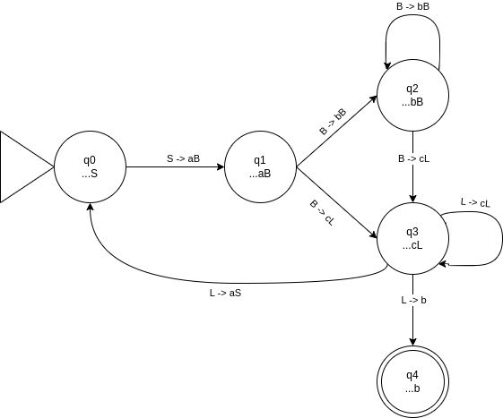
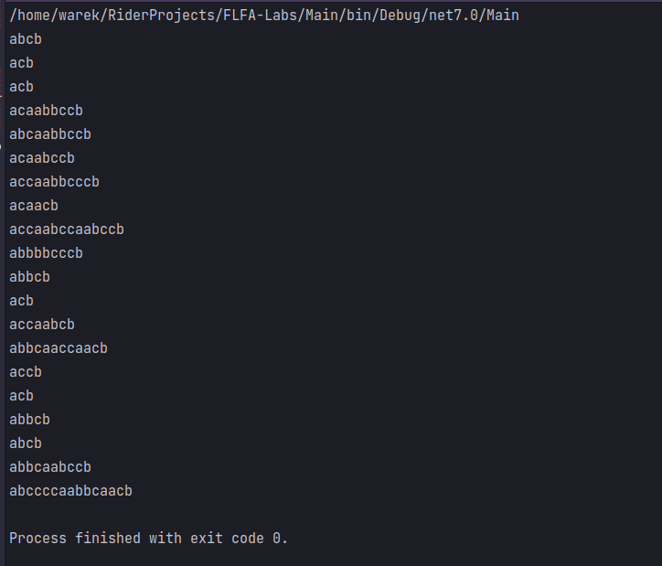
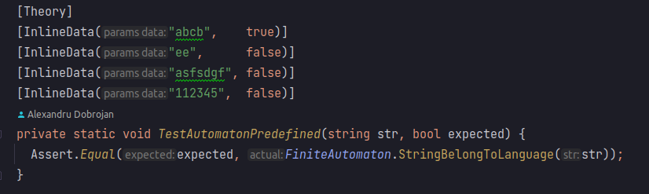
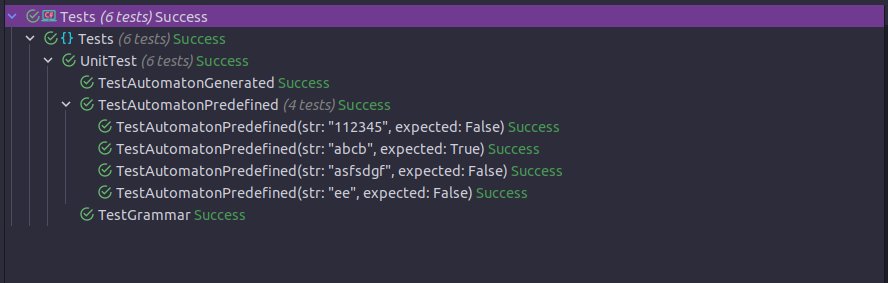

# Intro to formal languages. Regular grammars. Finite Automata.

### Course: Formal Languages & Finite Automata
### Author: Dobrojan Alexandru (FAF-212)

----

## Theory
This laboratory is meant to teach me the basics of how formal languages work and how they can be interpreted in code.\
A formal language (in software engineering context) consists of an alphabet, or a set of allowed symbols, grammar, or a set of rules how to
composite symbols of alphabet in a meaningful and understandable by a machine way and vocabulary that is a set of valid (allowed) words.\
Constructing words consists of starting from an initial state (or rule) and using a transition defined by Productions part of grammar to get to
the next alphabet (terminal) character or one or more syntactic variables (non-terminal symbols). The word is done when no non-terminal symbols
remain in our string.\
In order to find matching patterns of a formal language and check if a word or set of words belong to that language, we can use such concept as
Finite Automata, or Finite Automaton (singular). A Finite Automaton is a structure with members similar to a formal language that serves one reason -
to validate an input string. For that, Automaton constructs a graph of states that are unidirectional or bidirectional coupled by transitions,
transitions are the way of how to represent Grammar productions in graph, and iterates over that graph if the pattern matches. And if some character
cannot be transitioned by that graph, then the word does not belong to that formal language.


## Objectives:

1. Understand what a language is and what it needs to have in order to be considered a formal one.

2. Provide the initial setup for the evolving project that you will work on during this semester. I said project because usually at lab works, I encourage/impose students to treat all the labs like stages of development of a whole project. Basically you need to do the following:

   a. Create a local && remote repository of a VCS hosting service (let us all use Github to avoid unnecessary headaches);

   b. Choose a programming language, and my suggestion would be to choose one that supports all the main paradigms;

   c. Create a separate folder where you will be keeping the report. This semester I wish I won't see reports alongside source code files, fingers crossed;

3. According to your variant number (by universal convention it is register ID), get the grammar definition and do the following tasks:

   a. Implement a type/class for your grammar;

   b. Add one function that would generate 5 valid strings from the language expressed by your given grammar;

   c. Implement some functionality that would convert and object of type Grammar to one of type Finite Automaton;

   d. For the Finite Automaton, please add a method that checks if an input string can be obtained via the state transition from it;


## Implementation description

My implementation treats Grammar and Finite Automaton as two data structures that can be mutually converted.\
Grammar is closer to the mathematical representation by defining its 4 main components - the set of terminal characters, non-terminal characters,
set of Productions and the starting character. The constructor and converting to Finite Automaton is not important to us.
GenerateString method would randomly generate a string of the provided language. What is does iterate through each character and apply
a random transformation (or one in case there are no more matching) defined in Productions if it is non-terminal. If it has no non-terminal
symbols, then the string is returned.

Finite Automaton diagram:\


```c#
public string GenerateString() {
		var    rand          = new Random();
		string str           = _S;
		bool   shouldIterate = true;

		while (shouldIterate) {
			shouldIterate = false;

			foreach (char character in str) {
				if (_isNonTerminal(character.ToString()) || character == 'S') {
					shouldIterate = true;

					var matches = new List<string>();

					foreach (var ls in _P) {
						if (ls[0].Contains(character.ToString())) {
							matches.Add(ls[1]);
						}
					}

					str = str.Replace(
						character.ToString(),
						matches[rand.Next(0, matches.Count)]
					);
				}
			}
		}

		return str;
	}
```
And here is how it used in program
```c#
namespace Main;

public static class Program {
	public static readonly string[] Vn = { "S", "B", "L" };
	public static readonly string[] Vt = { "a", "b", "c" };

	public static readonly string[,] P = {
		{ "S", "aB" },
		{ "B", "bB" },
		{ "B", "cL" },
		{ "L", "cL" },
		{ "L", "aS" },
		{ "L", "b" }
	};

	public static void Main() {
		Grammar grammar = new(Vn, Vt, P, "S");

		for (int i = 0; i < 20; i++) {
			Console.WriteLine(grammar.GenerateString());
		}
	}
}
```
**Result:**\


Finite Automaton is similar to how it was described in theory. It consists of a set of states (each state is an instance of State class to make it
easier to construct graph and iterate it, they can be represented as strings or numbers also), alphabet (terminal symbols), non-terminal symbols and
the state names (again, not necessary but they'll make our life easier). At constructing time we make the states list that will represent our graph,
each state knows its previous and next states and its transition and also have a type - start, intermediate or final.
```c#
public class FiniteAutomaton {
	private class State {
		public enum StateType {
			Start,
			Intermediate,
			Final
		}

		public List<string> Transitions { get; init; } = new();
		public char         Key         { get; init; }
		public StateType    Type        { get; init; }
	}

	private readonly List<char>   _alphabet;
	private readonly List<string> _nonTerminals;
	private readonly List<State>  _states;
	private readonly List<char>   _stateNames;

    ...
```

The method StringBelongToLanguage iterates through the states graph searching if transitions can be made and if each characters belongs to alphabet
(and each non-terminal to non-terminals also). It is constructing a string meant to store the current string that will have to be identical
to input string in the end to match.
```c#
public bool StringBelongToLanguage(string str) {
		var    currentState = _findState('S')!;
		string s            = "";

		foreach (char character in str) {
			if (
				(currentState.Type == State.StateType.Final && s.Length != str.Length)
				|| !_isValidCharacter(character)
			) {
				return false;
			}

			currentState = _nextState(character, currentState);

			if (currentState is null) {
				return false;
			}

			s += character;
		}

		return currentState.Type == State.StateType.Final;
	}
```

## Conclusions / Screenshots / Results

Data structures and their methods are unit tested in a separate project of the same solution using xUnit unit testing library. Here is an example of a test:\
\
And here is the tests result:\
\

In conclusion I can say that Grammar and Finite Automata are a strong part in understanding how programming languages work (as well as scripting, markup,
regular expressions and other DSLs). Constructing a good Grammar and Finite Automaton is a tedious and hard task since it involves
strong domain knowledge, programming language knowledge, knowledge of edge cases and lots of testing. I think that programming languages parsers
work in a similar (but much more performance optimized) way as the implemented above code.


## References

**[GitHub repo](https://github.com/Warek01/FLFA-Labs)**