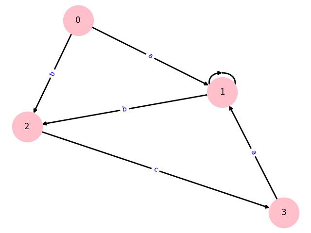
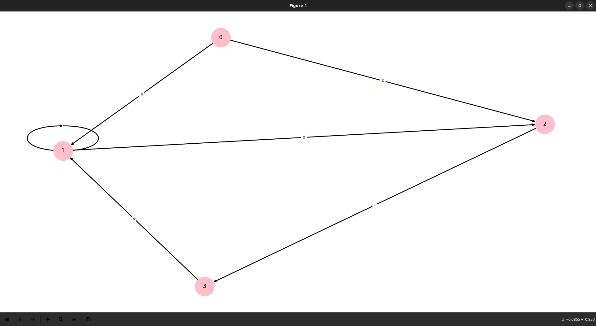

# Determinism in Finite Automata. Conversion from NDFA 2 DFA. Chomsky Hierarchy.

### Course: Formal Languages & Finite Automata

### Author: Dobrojan Alexandru (FAF-212)

----

## Theory

In this laboratory I have to apply my understanding of Non-deterministic Finite Automata and classification of grammars.
The problem of NFAs is that a computer
cannot solve explicitly it without some sort of processing of the grammar, I.e. it can get stuck into infinite loops or
generate wrong output.\
In order to solve this issue, I have to determine if the given grammar will lead to a non-deterministic Finite Automaton
and process it so it will become
a deterministic one. Determining a basic NFA is easy since we can basically check if we have 2 or more transitions with
the same value but different states,
and convert these transitions so they will lead to next states and become different.\
Chomsky classification is a hierarchy of formal grammars used to describe the structure of languages. It was introduced
by linguist Noam Chomsky in the 1950s and
categorizes grammars into four types, from the simplest to the most complex: Type-3 (Regular), Type-2 (Context-Free),
Type-1 (Context-Sensitive),
and Type-0 (Unrestricted). Each type has a set of rules and restrictions that define the class of languages it can
generate.

## Objectives:

1. Understand what an automaton is and what it can be used for.

2. Continuing the work in the same repository and the same project, the following need to be added:
   a. Provide a function in your grammar type/class that could classify the grammar based on Chomsky hierarchy.

   b. For this you can use the variant from the previous lab.

3. According to your variant number (by universal convention it is register ID), get the finite automaton definition and
   do the following tasks:

   a. Implement conversion of a finite automaton to a regular grammar.

   b. Determine whether your FA is deterministic or non-deterministic.

   c. Implement some functionality that would convert an NDFA to a DFA.

   d. Represent the finite automaton graphically (Optional, and can be considered as a __*bonus point*__):

    - You can use external libraries, tools or APIs to generate the figures/diagrams.

    - Your program needs to gather and send the data about the automaton and the lib/tool/API return the visual
      representation.

## Implementation description

In this laboratory I overhauled the code from previous laboratory so I have a stronger foundation to work with. Now I
represent each state as a simple object knowing its
transitions to next states and transitions are represented as (q_n, value) -> q_m, or in my case From: int, To: int,
Value: string. Verification of NFA is did just
as mentioned in the theory, checking if a state has 2 or more transitions with the same value but to different states
and used a heuristic algorithm to transform
each transition also as mentioned in the theory.

Here is the functions that checks if the Automaton is Non-Deterministic and transforms it in-place:

```cs
 private void _convertToDeterministic() {
     foreach (State state in _states) {
         var transitionsToAdd    = new List<KeyValuePair<string, State>>();
         var transitionsToRemove = new List<KeyValuePair<string, State>>();

         foreach (var transition1 in state.Transitions) {
             foreach (var transition2 in state.Transitions) {
                 if (Equals(transition1, transition2)) {
                     continue;
                 }

                 if (transition1.Key == transition2.Key) {
                     var t = transition2.Value == state ? transition1 : transition2;
                     foreach (var transition in t.Value.Transitions) {
                         transitionsToAdd.Add(
                             new KeyValuePair<string, State>(t.Key + transition.Key, transition.Value)
                         );
                     }

                     transitionsToRemove.Add(t);
                 }
             }
         }

         state.Transitions.AddRange(transitionsToAdd);

         foreach (var transition in transitionsToRemove) {
             state.Transitions.Remove(transition);
         }
     }
 }
```

Here is how I check if string belongs to language:

```cs
public bool StringBelongToLanguage(string str) {
   State currentState = _states[0];
   var   position     = 0;
   
   while (position < str.Length) {
      var newStateFound = false;
   
      foreach (var transition in currentState.Transitions) {
          if (!str[position..].StartsWith(transition.Key)) {
              continue;
          }
   
          currentState  =  transition.Value;
          position      += transition.Key.Length;
          newStateFound =  true;
          break;
      }
   
      if (!newStateFound) {
          return false;
      }
   }
   
   return _finalStates.Contains(currentState);
}
```

Here I draw the diagram using a python program that I wrote and invoked it from the Main method of my C# program

```csharp
// Draws the automaton diagram using a python library and saves it to file
 private static void DrawGraph() {
     try {
         var dataset = Transitions.Aggregate(
             "",
             (current, transition) => current + $" {transition.From} {transition.To} {transition.Value}"
         );

         ProcessStartInfo info = new() {
             FileName               = "python3",
             Arguments              = $"/home/warek/RiderProjects/FLFA-Labs/main.py {dataset}",
             RedirectStandardOutput = false,
             RedirectStandardError  = false,
             RedirectStandardInput  = false,
             UseShellExecute        = false,
             CreateNoWindow         = true
         };

         using Process process = new() {
             StartInfo = info
         };

         process.Start();
         process.WaitForExit();
     }
     catch (Exception exception) {
         Console.WriteLine("Something went wrong:");
         Console.WriteLine(exception.Message);
     }
 }
```

Python program invoked

```python
import sys
import matplotlib.pyplot as plt
import networkx as nx

G = nx.DiGraph()
dataset = []
edge_labels = {}

for i in range(1, len(sys.argv), 3):
	dataset += [[sys.argv[i], sys.argv[i + 1], sys.argv[i + 2]]]

for data in dataset:
	FROM = data[0]
	TO = data[1]
	VALUE = data[2]

	edge_labels[(FROM, TO)] = VALUE
	G.add_edge(FROM, TO, label=VALUE)

nx.set_edge_attributes(G, {('A', 'B'): {'color': 'red'}})

pos = nx.spring_layout(G)
plt.figure()
nx.draw(
	G, pos, edge_color='black', width=2,
	node_size=2000, node_color='pink', alpha=1,
	labels={node: node for node in G.nodes()}
)

nx.draw_networkx_edge_labels(
	G, pos,
	edge_labels=edge_labels,
	font_color='blue'
)

plt.savefig('/home/warek/RiderProjects/FLFA-Labs/plot.png')
plt.show()
```

## Conclusions / Screenshots / Results
Converting NFA to DFA in programming turned out not to be that hard, but it is relatively inefficient in terms of performance, since many loops and checks 
have to be performed.






## References

**[GitHub repo](https://github.com/Warek01/FLFA-Labs)**
