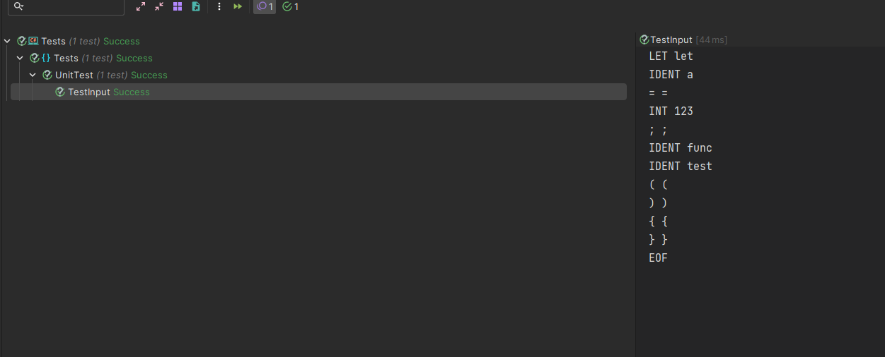

# Lexer & Scanner

### Course: Formal Languages & Finite Automata

### Author: Dobrojan Alexandru (FAF-212)

----

## Theory

The term lexer comes from lexical analysis which, in turn, represents the process of extracting lexical tokens from a
string of characters. There are several alternative names for the mechanism called lexer, for example tokenizer or
scanner. The lexical analysis is one of the first stages used in a compiler/interpreter when dealing with programming,
markup or other types of languages. The tokens are identified based on some rules of the language and the products that
the lexer gives are called lexemes. So basically the lexer is a stream of lexemes. Now in case it is not clear what's
the difference between lexemes and tokens, there is a big one. The lexeme is just the byproduct of splitting based on
delimiters, for example spaces, but the tokens give names or categories to each lexeme. So the tokens don't retain
necessarily the actual value of the lexeme, but rather the type of it and maybe some metadata.

## Objectives:

1. Understand what lexical analysis [1] is.
2. Get familiar with the inner workings of a lexer/scanner/tokenizer.
3. Implement a sample lexer and show how it works.

## Implementation description

In this laboratory I implement a basic lexer/scanner in C# that accepts a list of predefined
tokens. My lexer basically reads some input string character by character and based on what
characters it reads it performs analysis. Here is how it works:

First I define a class, where _input is the scanned string, _position is the current scan position
in input, _readPosition is where the _position should move after creating a token, for example it will be
3 after it processes a "let" keyword and _ch is the current character on _position.

```csharp
public partial class Lexer {
	private string _input;
	private int    _position     = 0;
	private int    _readPosition = 0;
	private char   _ch;
```

Next I define some basic logic for lexer, for example:

Read the next character:

```csharp
	private void _readChar() {
		if (_readPosition >= _input.Length) {
			_ch = (char)0;
		}
		else {
			_ch = _input[_readPosition];
		}

		_position = _readPosition;
		_readPosition++;
	}
```

Determine the _ch type, note that I consider _ as a letter so it can be used in pascal_case identifiers:

```csharp
	private bool IsOnLetter => _ch is >= 'a' and <= 'z' or >= 'A' and <= 'Z' or '_';
	private bool IsOnDigit  => _ch is >= '0' and <= '9';
```

And these are self-explanatory, I use these functions to firstly ignore all whitespace, since
the statements will be semicolon delimited, read an identifier and an integer. Yet there is no
logic to read floating point and negative numbers sadly.

```csharp
private string _readIdentifier() {
		int pos = _position;

		while (IsOnLetter) {
			_readChar();
		}

		return _input.Substring(pos, _position - pos);
	}

	private void _skipWhitespace() {
		while (_ch is ' ' or '\t' or '\n' or '\r') {
			_readChar();
		}
	}

	private string _readNumber() {
		int pos = _position;

		while (IsOnDigit) {
			_readChar();
		}

		return _input.Substring(pos, _position - pos);
	}
```

Next I declare in a separate file all the token types that my lexer will process,
if a token does not math the token type, it will be assigned "Illegal" type and later
cause a syntax error. Ideally TokenType should be a string enum, but C# does
not support typed enums other than integers, so I create a static class that
acts almost identically to a string enum.

```csharp

public static class TokenType {
	public const string Illegal = "ILLEGAL";
	public const string Eof     = "EOF";

	// Identifiers + literals
	public const string Ident = "IDENT";
	public const string Int   = "INT";

	// Operators
	public const string Plus   = "+";
	public const string Minus  = "-";
	public const string Assign = "=";
```

Next I define a Token class that acts as a wrapper for token, where Type is the TokenType
and literal is its code (raw) representation, for example for a variable Type will be TokenType.Ident and Literal -
<variable_name>

```csharp
public class Token {
	public string Type;
	public string Literal;

	public Token(string t, string l) =>
		(Type, Literal) = (t, l);
}
```

Next follows the scanning logic of the lexer, I define it in a separate file (that's why I am using
partial class). First I initialize the token as Illegal, so if it will not be assigned in the subsequent
switch statement it will automatically cause syntax error. Next I skip whitespace and start analyzing

```csharp

public partial class Lexer {
	public Token.Token NextToken() {
		Token.Token token = new(TokenType.Illegal, _ch.ToString());

		_skipWhitespace();

		switch (_ch) {
			case (char)0:
				token = new(TokenType.Eof, "");
				break;
			case '=':
				if (_peekChar() == '=') {
					char ch = _ch;
					_readChar();
					token = new(TokenType.Eq, $"{ch}{_ch}");
				}
				else {
					token = new(TokenType.Assign, _ch.ToString());
				}

```

Here is an example of processing the bang operator de determine if its a part of negation, !&lt;variable&gt;
or != (not equal) operators. The default case tries to read an identifier or a integer. If none
of them pass, the default **INVALID** token is being returned.

```csharp
case '!':
    if (_peekChar() == '=') {
        char ch = _ch;
        _readChar();
        token = new(TokenType.Ne, $"{ch}{_ch}");
    }
    else {
        token = new(TokenType.Bang, _ch.ToString());
    }

    break;
default:
    if (IsOnLetter) {
        string literal = _readIdentifier();
        token = new(Keywords.Keywords.LookupIdent(literal), literal);
    }
    else if (IsOnDigit) {
        token = new(TokenType.Int, _readNumber());
        return token;
    }
```

And that's it. Here is an example of how it works. I define a sample input containing
the syntax that I defined earlier and I get an output in format **&lt;TOKEN_TYPE&gt; &lt;Literal&gt;**

```csharp
public static class Program {
	public static void Main() {
		Lexer lexer = new(@"
			let a = 123;
			func test () {}
		");
		
		while (true) {
			Token token = lexer.NextToken();
		
			Console.WriteLine($"{token.Type} {token.Literal}");
			
			if (token.Type == TokenType.Eof) {
				break;
			} 
		}
	}
}
```

## Conclusions / Screenshots / Results

The output:

```
LET let
IDENT a
= =
INT 123
; ;
IDENT func
IDENT test
( (
) )
{ {
} }
EOF
```

In conclusion, writing a lexer in C# can be a challenging but rewarding task, as it provides a foundation for building
more complex parsing and compilation tools. To write a lexer, it is important to understand the principles of lexical
analysis, such as tokenization and regular expressions, and to choose appropriate data structures and algorithms to
efficiently parse and analyze input. With the right tools and techniques, it is possible to create a robust and
efficient lexer that can be used in a wide range of applications.


## Testing

Here is an example of unit testing my lexer
```csharp
public class UnitTest {
	private readonly ITestOutputHelper _testOutputHelper;
	public UnitTest(ITestOutputHelper testOutputHelper) {
		_testOutputHelper = testOutputHelper;
	}

	[Fact]
	private void TestInput() {
		string input = @"
			let a = 123;
			func test () {}
		";

		KeyValuePair<string, string>[] expectedTokens = {
			new KeyValuePair<string, string>(TokenType.Let, "let"),
			new KeyValuePair<string, string>(TokenType.Ident, "a"),
			new KeyValuePair<string, string>(TokenType.Assign, "="),
			new KeyValuePair<string, string>(TokenType.Int, "123"),
			new KeyValuePair<string, string>(TokenType.Semicolon, ";"),
			new KeyValuePair<string, string>(TokenType.Ident, "func"),
			new KeyValuePair<string, string>(TokenType.Ident, "test"),
			new KeyValuePair<string, string>(TokenType.Lparen, "("),
			new KeyValuePair<string, string>(TokenType.Rparen, ")"),
			new KeyValuePair<string, string>(TokenType.Lbrace, "{"),
			new KeyValuePair<string, string>(TokenType.Rbrace, "}"),
			new KeyValuePair<string, string>(TokenType.Eof, ""),
		};
		
		Lexer lexer = new(input);

		Assert.NotNull(lexer);

		int i = 0;

		while (i < expectedTokens.Length) {
			Token token = lexer.NextToken();
			
			_testOutputHelper.WriteLine($"{token.Type} {token.Literal}");
			Assert.Equal(token.Type, expectedTokens[i].Key);
			Assert.Equal(token.Literal, expectedTokens[i].Value);

			i++;
		}
	}
}
```


