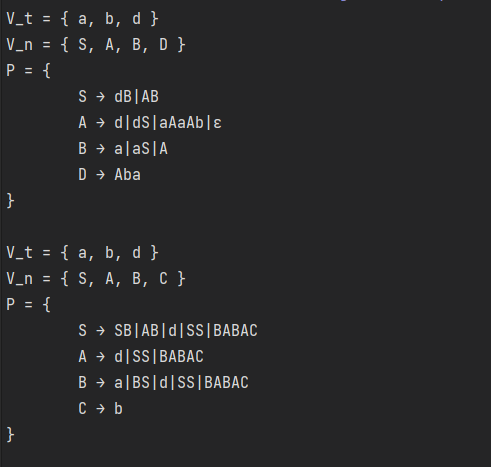

# Chomsky Normal Form

### Course: Formal Languages & Finite Automata

### Author: Dobrojan Alexandru (FAF-212)

----

## Theory

CNF stands for Chomsky Normal Form, which is a way of representing a context-free grammar (CFG) in a specific form.

In CNF, every production rule has one of two forms:

either a single non-terminal symbol produces two non-terminal symbols,

or a single non-terminal symbol produces a single terminal symbol.

This form makes parsing easier and more efficient, which is why many algorithms and parsers rely on grammars being in CNF. Converting a CFG to CNF involves breaking down longer production rules into smaller ones that fit the required forms.

To convert a Context-Free Grammar (CFG) to Chomsky Normal Form (CNF), we need to follow a set of steps:

Remove all ε-productions from the grammar.
Remove all unit productions from the grammar.
Convert all remaining productions to have either two non-terminals or a non-terminal and a terminal on the right-hand side.
If a production has more than two non-terminals on the right-hand side, split it into multiple productions.
After performing these steps, the resulting grammar will be in CNF.

## Objectives:

1. Learn about Chomsky Normal Form (CNF) [1].
2. Get familiar with the approaches of normalizing a grammar.
3. Implement a method for normalizing an input grammar by the rules of CNF.
    1. The implementation needs to be encapsulated in a method with an appropriate signature (also ideally in an appropriate class/type).
    2. The implemented functionality needs executed and tested.
    3. A BONUS point will be given for the student who will have unit tests that validate the functionality of the project.
    4. Also, another BONUS point would be given if the student will make the aforementioned function to accept any grammar, not only the one from the student's variant.

## Implementation description

I organized all the related code in a class called Grammar. The Grammar initialization is quite 
straightforward. I store productions grouped, rather than separated.
```csharp
public Grammar(string[] nonTerminals, string[] terminals, KeyValuePair<string, string>[] productions) {
    _nonTerminals = new(nonTerminals);
    _terminals    = new(terminals);

    foreach (var pair in productions) {
        var prod = _productions.Find(
            p => p.Key == pair.Key
        );

        if (prod.Key is null) {
            _productions.Add(
                new KeyValuePair<string, List<string>>(
                    pair.Key, new List<string>(new[] { pair.Value })
                )
            );
        }
        else {
            prod.Value.Add(pair.Value);
        }
    }
}
```

The normalization algorithm is divided into private subroutines:
```csharp
public void Normalize() {
    _eliminateEpsProductions();
    _eliminateRenaming();
    _eliminateInaccessibleSymbols();
    _eliminateNonProductiveSymbols();
    _eliminateUnusedNonTerminals();
    _eliminateUnusedTerminals();
    _eliminateDuplicateProd();
}
```

Here is how I eliminate Epsilon (empty) productions.
I determine which production rule contains an empty transition and then change the 
values in all other rules to contain the right value.
```csharp
private void _eliminateEpsProductions() {
    List<string> prodsToFix = new();

    foreach (var prod in _productions) {
        bool prodContainsEps = false;
        foreach (var transition in prod.Value) {
            if (transition == "ε") {
                prodContainsEps = true;
            }
        }

        if (!prodContainsEps) {
            continue;
        }

        prod.Value.Remove("ε");
        prodsToFix.Add(prod.Key);
    }

    foreach (var prodToFix in prodsToFix) {
        foreach (var prod in _productions) {
            if (prod.Key == prodToFix) {
                continue;
            }

            List<string> prodsToAdd = new();

            foreach (var transition in prod.Value) {
                if (!transition.Contains(prodToFix)) {
                    continue;
                }

                foreach (var transToFix in _productions.Find(p => p.Key == prodToFix).Value) {
                    prodsToAdd.Add(transToFix);
                }
            }

            prod.Value.AddRange(prodsToAdd);
        }
    }
}
```

Here I eliminate renamings (1 non-terminal -> 1 non-terminal).
I simply check if the transition is to one non-terminal and inline the values,
then remove the old transition.
```csharp
private void _eliminateRenaming() {
    foreach (var prod in _productions) {
        List<string> prodsToFix = new();

        foreach (var transition in prod.Value) {
            if (transition.Length == 1 && _nonTerminals.Contains(transition)) {
                prodsToFix.Add(transition);
            }
        }

        foreach (var transition in prodsToFix) {
            prod.Value.Remove(transition);
            prod.Value.AddRange(_productions.Find(p => p.Key == transition).Value);
        }
    }
}
```

Here I eliminate inaccessible symbols.
I basically do a DFS starting from start symbol S, put values into a Set to not repeat 
ant then remove the production rules that have not been visited.
```csharp
private void _eliminateInaccessibleSymbols() {
    HashSet<string> visited = new();
    List<string>    queue   = new();

    void Visit(string key, int depth) {
        if (depth == _productions.Count) {
            return;
        }

        visited.Add(key);
        var current = _productions.Find(p => p.Key == key);

        foreach (var transition in current.Value) {
            foreach (var ch in transition) {
                if (_nonTerminals.Contains(ch.ToString())) {
                    Visit(ch.ToString(), depth + 1);
                }
            }
        }
    }

    Visit("S", 0);

    for (int i = 0; i < _productions.Count - visited.Count; i++) {
        _productions.RemoveAt(
            _productions.FindIndex(
                p => !visited.Contains(p.Key)
            )
        );
    }
}
```

Here is how I eliminate unused Non-terminals after all the steps, the same is applied 
for terminals.
```csharp
private void _eliminateUnusedNonTerminals() {
    HashSet<string> used = new();

    foreach (var pair in _productions) {
        foreach (var transition in pair.Value) {
            foreach (var ch in transition) {
                if (_nonTerminals.Contains(ch.ToString())) {
                    used.Add(ch.ToString());
                }
            }
        }
    }

    List<string> newNonTerminals = new();

    foreach (var symb in _nonTerminals) {
        if (used.Contains(symb)) {
            newNonTerminals.Add(symb);
        }
    }

    _nonTerminals = newNonTerminals;
}
```

Here is how I print the Grammar:
```csharp
public override string ToString() {
    string str = "V_t = { ";

    foreach (var terminal in _terminals) {
        str += $"{terminal}{(terminal != _terminals.Last() ? "," : "")} ";
    }

    str += "}\nV_n = { ";

    foreach (var nonTerminal in _nonTerminals) {
        str += $"{nonTerminal}{(nonTerminal != _nonTerminals.Last() ? "," : "")} ";
    }

    str += "}\nP = {\n";

    foreach (var prod in _productions) {
        str += $"\t{prod.Key} → ";

        foreach (var dest in prod.Value) {
            str += $"{dest}{(dest != prod.Value.Last() ? "|" : "")}";
        }

        str += "\n";
    }

    str += "}\n";

    return str;
}
```

And this is basically my main program
```csharp
public static class Program {
	public static readonly string[] NonTerminalsSet = { "S", "A", "B", "D" };
	public static readonly string[] TerminalsSet    = { "a", "b", "d" };

	public static readonly KeyValuePair<string, string>[] ProductionsSet = {
		new("S", "dB"),
		new("S", "AB"),
		new("A", "d"),
		new("A", "dS"),
		new("A", "aAaAb"),
		new("A", "ε"),
		new("B", "a"),
		new("B", "aS"),
		new("B", "A"),
		new("D", "Aba"),
	};

	public static void Main() {
		Grammar grammar = new(NonTerminalsSet, TerminalsSet, ProductionsSet);
		Console.WriteLine(grammar);
		grammar.Normalize();
		Console.WriteLine(grammar);
	}
}
```


## Conclusions / Screenshots / Results
In conclusion I can say that Chomsky Normal Form of a Grammar is a more concise way to 
represent that grammar, allowing fitting that grammar into smaller bounds and making it more 
easier to read than a non-normalized one. Plus it makes comparing grammars a lot easier to 
determine if 2 grammars are equal. Normalization is not an easy task, especially as a computer algorithm 
and is quite resource-demanding.

Output (how it was and in Chomsky Normal Form):

